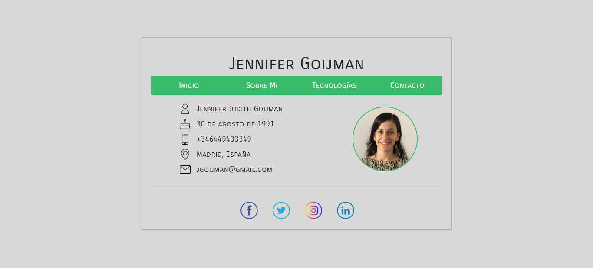

# Portfolio

This was my first coding Bootcamp project: my portfolio.
It was made with HTML3, CCS3 & Vanilla JS.

## Views

### Home
 

### About me
 

### Techs
 

### Contact
 

You can see the demo here: https://jennifergoijman.github.io/GeeksHubs-P2---Website-2.0/html/
